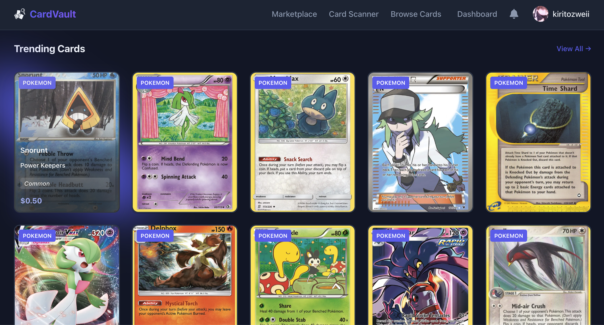

# CardVault Frontend

React + Vite client for the CardVault Pokemon TCG marketplace.

## Features

- Browse marketplace listings and card details
- Search cards and view price history charts
- Manage collection and wishlist
- Create listings, receive offers, and complete checkout flows
- Auth with email/password and Auth0 social login

## Tech Stack

- React 19
- Vite 7
- React Router
- Auth0 React SDK
- Axios
- Chart.js + react-chartjs-2
- Stripe JS

## Screenshot



## Environment Variables

Create `frontend/.env`:

```env
VITE_API_URL=http://localhost:5000/api
VITE_AUTH0_DOMAIN=your-auth0-domain
VITE_AUTH0_CLIENT_ID=your-auth0-client-id
VITE_AUTH0_AUDIENCE=your-auth0-audience
VITE_STRIPE_PUBLISHABLE_KEY=pk_test_your_key
```

## Run Locally

```bash
cd frontend
npm install
npm run dev
```

The app runs on `http://localhost:5173` by default.

## Available Scripts

- `npm run dev` - start development server
- `npm run build` - production build
- `npm run preview` - preview production build
- `npm run lint` - run ESLint
